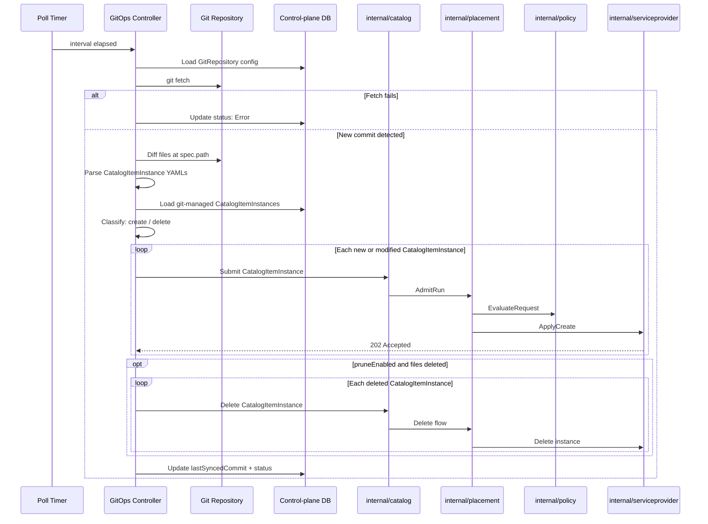

# GitOps Controller -- Git-driven CatalogItemInstance Lifecycle

## Open Questions

1. Should the GitOps controller run as a separate process or as a package inside
   the `dcm-server` control-plane (new `internal/gitops/` package)?
2. Should deletion of CatalogItemInstances from DCM be automatic when a YAML
   file is removed from Git, or should deletion always require explicit action
   regardless of the `pruneEnabled` setting?

## Summary

This enhancement adds Git-driven CatalogItemInstance lifecycle management to
DCM. A new `GitRepository` API resource lets users point DCM at a Git repository
containing CatalogItemInstance YAML definitions. A GitOps controller inside the
control plane periodically polls configured repositories, detects changes to
CatalogItemInstance files, and reconciles DCM state to match the desired state
declared in Git. The controller automatically applies changes from Git, reports
sync status, and detects drift between Git and DCM state.

## Motivation

Platform teams adopting DCM want the same Git-as-source-of-truth workflow they
use for infrastructure and Kubernetes workloads. Today, CatalogItemInstances are
submitted exclusively through the DCM API (either directly or via the UI). This
forces teams to build custom CI/CD integrations to bridge Git and DCM. A native
GitOps capability removes that gap, enables PR-based review for
CatalogItemInstance changes, provides a clear audit trail via Git history, and
allows teams to manage CatalogItemInstance definitions alongside the
infrastructure code that supports them.

The declarative-api enhancement already identifies "User/GitOps" as a submission
source
([see the architecture diagram in declarative-api.md](../declarative-api/declarative-api.md)),
confirming that GitOps was anticipated as a first-class entry point into the
catalog and placement flow.

### Goals

- Define a new `GitRepository` API resource for configuring Git repository
  connections (URL, branch, path, polling interval and pruning behavior).
- Define a GitOps controller component that polls Git repositories, detects
  changes, and reconciles CatalogItemInstance state in DCM.
- Integrate with the existing catalog/placement flow -- the GitOps controller
  submits CatalogItemInstances through the same internal path as API-driven
  submissions.
- Provide sync status reporting and drift detection (Git state vs DCM state).
- Define the behavior for create and delete of CatalogItemInstances based on Git
  file changes.

### Non-Goals

- Watching non-CatalogItemInstance resources in Git (placements, service
  providers, policies, catalog items are out of scope).
- Webhook/push-based sync (only polling in v1; webhook can be added later as an
  optimization).
- Supporting Helm charts, Kustomize overlays, or any templating beyond raw DCM
  CatalogItemInstance YAML.
- Multi-cluster or federated GitOps (one DCM control plane, one controller).
- Git write-back (writing DCM status back into the Git repo).
- Approval-required reconciliation mode (deferred; v1 is auto-apply only).
- Handling Git authentication/credentials (users must provide Git repos that are
  public or otherwise accessible without custom credential management; v1 does
  not solve general Git credentials).
- Defining behavior for update operations on existing CatalogItemInstances (how
  updates in Git are propagated to instances in DCM) is out of scope for this
  enhancement and will be specified in a future proposal.

## Proposal

### Overview

The proposal introduces two resources and a controller:

1. **`GitRepository` resource** -- a new DCM API object that configures a
   connection to a Git repository. The resource specifies which branch and path
   to watch, how often to poll and whether to prune CatalogItemInstances removed
   from Git.

2. **GitOps controller** -- a new `internal/gitops` package in the
   `dcm-platform` control-plane. It runs a background reconciliation loop
   started when `dcm-server` boots. For each `GitRepository` resource, the
   controller clones/fetches the repo at the configured interval, detects
   changes to CatalogItemInstance YAML files, and submits create/delete
   operations through the existing catalog package.

### User Stories

#### Story 1 -- Platform engineer configures a Git source

A platform engineer has a Git repository
`https://git.example.com/team/dcm-apps.git` with CatalogItemInstance YAML files
under `apps/production/`. They create a `GitRepository` resource via the DCM API
specifying the repo URL, branch `main`, path `apps/production/`, a 60-second
polling interval. The GitOps controller begins polling and submits any
CatalogItemInstance definitions it finds.

#### Story 2 -- CatalogItemInstance removed from Git

A developer removes an CatalogItemInstance YAML file from the watched path and
merges the change. If `pruneEnabled` is `true`, the GitOps controller detects
the deletion and automatically deletes the corresponding CatalogItemInstance in
DCM. If `pruneEnabled` is `false`, the controller logs the deletion but takes no
action.

### Implementation Details/Notes/Constraints

#### GitRepository Resource Schema

```yaml
apiVersion: v1alpha1
kind: GitRepository
metadata:
  name: production-apps
spec:
  url: "https://git.example.com/team/dcm-apps.git"
  ref:
    branch: main
  path: "apps/production/"
  interval: 60s
  reconciliation:
    pruneEnabled: true
    retryPolicy:
      maxRetries: 3
      backoffSeconds: 30
```

**Spec fields:**

| Field                                            | Type     | Default  | Description                      |
| ------------------------------------------------ | -------- | -------- | -------------------------------- |
| `spec.url`                                       | string   | required | Git repository URL               |
| `spec.ref.branch`                                | string   | `main`   | Branch to watch                  |
| `spec.path`                                      | string   | `/`      | Path within the repo             |
| `spec.interval`                                  | duration | `60s`    | Polling interval (min 10s)       |
| `spec.reconciliation.pruneEnabled`               | bool     | `false`  | Delete DCM apps removed from Git |
| `spec.reconciliation.retryPolicy.maxRetries`     | int      | `3`      | Max retries on submit failure    |
| `spec.reconciliation.retryPolicy.backoffSeconds` | int      | `30`     | Backoff between retries          |

**Sync statuses:**

| Status        | Meaning                                   |
| ------------- | ----------------------------------------- |
| `Synced`      | DCM state matches Git at lastSyncedCommit |
| `Error`       | Sync failed (auth, network, parse errors) |
| `Progressing` | Sync in progress                          |

**Sync status transitions:**

- **Synced**: The controller sets the status to `Synced` when the contents of
  the Git repository match the state in the database: all specifications present
  in Git are reflected in DCM, and there have been no failures in creating or
  applying any of those specs.
- **Error**: If the controller attempts to create or update a spec from Git in
  DCM and that operation fails, the status transitions to `Error`. This captures
  any failure when synchronizing the desired state from Git into the system.
- **Progressing**: When the controller detects new or modified content in the
  watched Git repository, it moves the status to `Progressing`. This state
  persists while those changes are being applied to DCM, and only reverts to
  `Synced` after all updates are successfully completed.

These status flags help users and systems track the current reconciliation phase
and any issues that might need intervention.

#### API Endpoints

| Method | Endpoint                                     | Description            |
| ------ | -------------------------------------------- | ---------------------- |
| POST   | `/api/v1alpha1/git-repositories`             | Create a GitRepository |
| GET    | `/api/v1alpha1/git-repositories`             | List GitRepositories   |
| GET    | `/api/v1alpha1/git-repositories/{id}`        | Get a GitRepository    |
| PUT    | `/api/v1alpha1/git-repositories/{id}`        | Update a GitRepository |
| DELETE | `/api/v1alpha1/git-repositories/{id}`        | Delete a GitRepository |
| GET    | `/api/v1alpha1/git-repositories/{id}/status` | Get sync status        |
| POST   | `/api/v1alpha1/git-repositories/{id}:sync`   | Trigger immediate sync |

#### Controller Architecture

```
internal/gitops/
  controller.go      # main reconciliation loop
  repository.go      # git clone/fetch/diff operations
  parser.go          # parse CatalogItemInstance YAML from files
  reconciler.go      # diff desired (Git) vs actual (DCM)
  api.go             # HTTP handlers for git-repositories
```

The controller is wired into `cmd/dcm-server/` on boot and runs a goroutine pool
with one timer per `GitRepository` resource.

#### Reconciliation Loop

```mermaid
flowchart TD
    A[Timer fires at spec.interval] --> C[Fetch Git repo]
    C --> E{New commit?}
    E --> K[Diff CatalogItemInstance YAMLs]
    K --> L[Classify: Created / Deleted]
    L --> M[Submit changes to catalog]
    M --> N[Update lastSyncedCommit]
    N --> Update status: Synced
```

#### Interaction with Existing Catalog/Placement Flow

The GitOps controller acts as an automated submission source. It does NOT bypass
catalog or placement:

1. **Create**: Controller calls the same `internal/catalog` function that
   handles `POST /api/v1alpha1/catalog-item-instances`. Catalog resolves the
   blueprint, placement builds the DAG, policy evaluates, and SPRM provisions.

2. **Delete**: Controller calls the delete path through catalog, which triggers
   the existing delete flow through placement and SPRM.

Each CatalogItemInstance created by the GitOps controller is tagged with
metadata:

- `gitops.dcm.io/managed-by: gitops-controller`
- `gitops.dcm.io/repository: <git-repository-id>`
- `gitops.dcm.io/source-path: apps/production/my-app.yaml`
- `gitops.dcm.io/commit: <sha>`

This metadata enables drift detection and prevents conflicts with manually
created CatalogItemInstances.

#### Conflict Resolution

| Scenario                    | Behavior                                     |
| --------------------------- | -------------------------------------------- |
| Git changed, DCM unchanged  | Auto-apply Git state                         |
| Git unchanged, DCM changed  | Drift detected; re-apply Git state           |
| Git changed AND DCM changed | Git wins; re-apply Git state                 |
| App in DCM but not in Git   | If `pruneEnabled`: delete; otherwise ignore  |
| App in Git but not in DCM   | Create in DCM                                |
| Invalid YAML in Git         | Skip file; report error in status conditions |

#### Database Schema Additions

New tables in the control-plane database:

- `git_repositories` -- stores GitRepository resource fields, status, and last
  synced commit.

## Design Details



## Drawbacks

- Polling adds load on both DCM and Git servers, especially with many
  repositories or short intervals. Webhook support would be more efficient but
  adds complexity and requires DCM to expose an ingress endpoint.
- Git-as-source-of-truth means operators must commit changes to Git rather than
  using the DCM API directly for GitOps-managed CatalogItemInstances.
- The controller runs inside the control-plane, meaning a bug in the polling
  loop could affect the API server. Mitigation: the controller runs in its own
  goroutine pool with panic recovery and circuit breakers.

## Alternatives

### Alternative 1 -- Webhook-based sync

#### Description

Instead of polling, DCM exposes a webhook endpoint that Git providers call on
push events. The controller processes changes on-demand rather than on a timer.

#### Pros

- Near-instant sync; no polling overhead.
- Lower resource usage when repositories change infrequently.

#### Cons

- Requires DCM to expose an externally reachable HTTP endpoint.
- Git-provider-specific webhook payload formats (GitHub, GitLab, Gitea differ).
- Missed webhooks require a fallback polling mechanism anyway.

#### Status

Deferred

#### Rationale

Polling is simpler to implement, works with any Git provider (generic git
protocol), and does not require DCM to be reachable from the Git server. Webhook
support can be added as an optimization later, with polling as the fallback.

### Alternative 2 -- Separate GitOps microservice

#### Description

Run the GitOps controller as a standalone service outside `dcm-server`,
communicating with DCM via the public HTTP API.

#### Pros

- Isolates polling workload from the API server.
- Can scale independently.
- Failures do not affect core DCM operations.

#### Cons

- HTTP latency and auth overhead for every CatalogItemInstance submission.
- Must maintain API contract compatibility.

#### Status

Deferred

#### Rationale

The control-plane enhancement established that all control-plane functions run
in one process. The GitOps controller follows that pattern as `internal/gitops`.
If polling load becomes a concern at scale, extraction into a separate service
is possible without redesign since the controller interacts with catalog through
a Go interface.

## Future Improvements

- **Approval-required reconciliation mode**: Add a configurable mode where
  changes produce pending sync records that an operator must approve before they
  are applied.
- **Webhook-based sync**: Add an optional webhook endpoint for near-instant
  sync, with polling as the fallback (see Alternative 1).
- **Support for Git credentials**: Allow users to configure authentication
  credentials (such as HTTPS username/password or SSH keys) for private
  repositories. The GitRepository resource would be extended to reference or
  store credential information securely, enabling the GitOps controller to
  access private repositories in enterprise environments.
